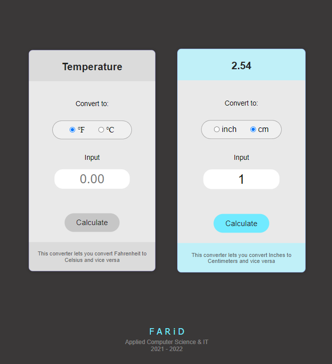

# Welcome to Farid Github Page

My name is Farid. I'm a first-year student in the IT Innovation and Design program at [Conestoga College](https://www.conestogac.on.ca/).

## CONTACT
- 299 Doon Valley Drive
- Kitchener, Ontario N2G 4M4, Canada
- Phone: 519-748-5220


## SOFT SKILL

###Graphic design
- Adobe Photoshop
- Adobe Illustrator

###Video Editing
- Adobe Premire Pro
- Vegas Pro
- Filmora
- 
**MS Office Suite


## HARD SKILL
```markdown
**Web Development
- HTML
- CSS
- JavaScript

**Software Development
**C Sharp (C#)
**DataBase
- Access

```

## My College Projects




**Thanks for taking a look at my portfolio!
